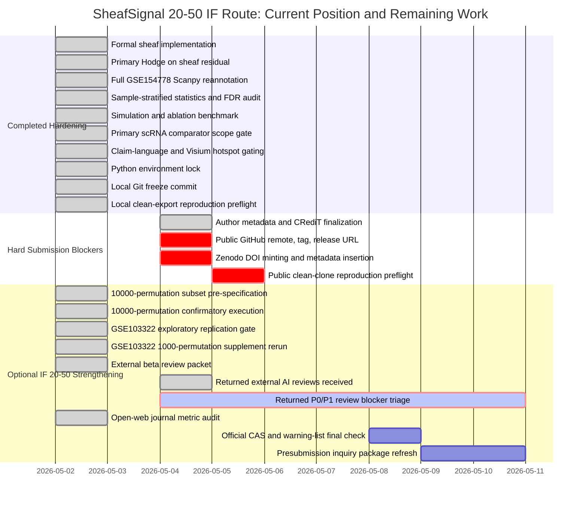

# SheafSignal IF 20-50 Distance Report

- Decision: `IF20_50_RETURNED_EXTERNAL_REVIEW_BLOCKERS_REMAIN`
- Overall readiness index: `98.0%`
- Scientific/method hardening index: `97.0%`
- Submission infrastructure index: `100.0%`
- Clean-export reproduction preflight: `local_clean_export_pass`
- Journal metric audit: `publisher_if_verified_cas_warning_final_check_required`
- Journal submission-day check: `template_ready`
- External beta review packet: `internal_ai_reviews_triaged_external_human_pending`
- External beta review triage: `returned_reviews_with_fatal_concerns`
- Returned-review open P0/P1 blockers: `56`
- Shareable review bundle: `ready`
- 10,000-permutation confirmatory subset: `completed_10000`
- GSE103322 replication supplement: `supplement_ready`
- Live release blocking gates: `0` of `7`
- External authorization statuses: `cleared=1, configured=1, env_token_available_persistent_login_missing=1, present=4, valid=2`
- Zenodo preflight statuses: `pass=16`
- Author confirmation severities: `pass=11`
- Author response template: `applied`
- Score boundary: these are internal readiness indices, not acceptance probabilities.

## Direct Answer

SheafSignal is not submission-ready for a 20-50 IF journal after the returned external-AI review cycle. The core release infrastructure is much stronger than before, and several code-level issues have already been patched, but the current gating problem is scientific: the rank-one sheaf construction may be judged equivalent to a standard graph coboundary, and the simulation ground truth remains too coupled to the residual definition. The next defensible step is not DOI or formatting; it is resolving or formally downgrading the returned P0/P1 review items.

The journal-metric audit now anchors the target board to publisher metric pages, while keeping CAS-zone and warning-journal status as official submission-day checks. This strengthens journal selection discipline without turning journal metrics into scientific evidence.

Returned external-AI reviews have now been filed and triaged, and `56` P0/P1 items currently block the 20-50 IF route. These reviews are correlated AI critiques, not formal peer review, but the code-grounded findings are strong enough to pause submission until fixed or explicitly downgraded by design.

The 10,000-permutation confirmatory subset is now both pre-specified and executed for the smallest GSE154778 manuscript-relevant tests. This improves p-value and FDR resolution for the statistical evidence, but it still must not be used to turn computational Myeloid, curl-like, or edge-level signals into validated biological mechanisms.

GSE103322 has now completed a 1000-permutation, sample-stratified HNSCC replication rerun and can be used as supplement-grade workflow generality evidence. It still should not be used for primary comparator-completeness claims unless full external comparator imports are completed for this dataset.

For the 20-50 IF route, returned-review P0/P1 items are now the dominant distance from submission. The highest-impact fixes are: choose the honest method route for the rank-one sheaf issue, replace or supplement the circular simulation with an independent perturbation task, add core/adapters tests, and keep all real-data biological claims strictly hypothesis-generating until those gates are clear.

The GSE103322 HNSCC supplement-grade replication gate is now complete, but it remains outside primary comparator-completeness claims.

## Current Gap Counts

- Blocking gap rows in the matrix: `2`
- Returned-review blocker rows: `56`
- Administrative pending rows: `0`
- Author-owned metadata rows: `0`
- Git release warnings: `0`

## Mandatory Before Any 20-50 IF Submission

- R1. Resolve or formally downgrade returned-review P0/P1 blockers listed in external_ai_review_packet/external_beta_review_action_matrix.tsv. Expected effect: converts external beta review from a submission blocker into a documented pre-review response matrix.

## Live Release And Author Gates

| Gate | Priority | Owner | Current status | Required action |
|---|---|---|---|---|
| `G01_github_auth` | `blocking` | `user_then_codex` | `valid` | No user action needed; Codex can use GH_TOKEN from the local token file. |
| `G02_public_github_repo` | `blocking` | `codex_after_auth` | `public_remote_branch_available` | Create or connect a public GitHub repository and push the frozen branch. |
| `G03_release_tag` | `blocking` | `codex_after_github` | `completed` | Create an immutable release tag after final audits pass. |
| `G04_zenodo_doi` | `blocking` | `user_then_codex` | `completed` | No action needed. |
| `G05_metadata_insertion` | `blocking` | `codex_after_doi` | `completed` | No action needed. |
| `G06_public_clean_clone` | `blocking` | `codex_after_public_release` | `completed` | No action needed. |
| `G07_author_confirmation` | `blocking` | `authors` | `AUTHOR_CONFIRMATION_READY` | No action needed; author-owned declarations are applied. |
| `S01_external_beta_review` | `strengthening` | `user_or_codex_packet` | `recommended_not_required_for_local_go` | Send the package to 2-3 independent computational biology readers and triage responses. |
| `S02_submission_day_metric_check` | `strengthening` | `codex` | `pending_submission_day` | Recheck journal metrics, CAS zone, and warning status on the submission day. |

## High-Value Optional Strengthening

- S1. Keep the completed pre-specified 10,000-permutation GSE154778 confirmatory subset as statistical-strengthening evidence, without promoting computational signals into biological mechanisms. Expected effect: Improves statistical defensibility; still does not create causal, clinical, therapeutic, or mechanism evidence.
- S2. Keep GSE103322 as a supplement-grade HNSCC replication after the 1000 sample-stratified rerun, while keeping it outside primary comparator-completeness claims. Expected effect: Improves 20-50 IF resilience against dataset-specific-artifact criticism.
- S4. Refresh the journal metric audit on the submission day, covering latest JIF source, CAS zone, and warning-journal status for the chosen target. Expected effect: Prevents stale IF/CAS/warning claims in the final submission plan.
- S5. Keep Visium hotspot-only unless adding deconvolution or histology/pathology annotation. Expected effect: Prevents overclaiming while preserving spatial workflow demonstration value.
- S3. After the returned-review P0/P1 matrix is fixed or downgraded by design, send the revised package to at least one non-correlated reviewer or model. Expected effect: checks whether the same fatal objections survive the remediation cycle.

## Journal Route Snapshot

- Nature Methods: JIF 32.1, 5-year JIF 51.7, route `keep_primary`, CAS/warning boundary `third_party_suggests_cas_1q_top_but_not_officially_verified` / `not_detected_in_accessible_2025_warning_list_mirrors`.
- Nature Biotechnology: JIF 41.7, 5-year JIF 59.5, route `stretch_only`, CAS/warning boundary `third_party_suggests_cas_1q_but_not_officially_verified` / `not_detected_in_accessible_2025_warning_list_mirrors`.
- Molecular Cancer: JIF 33.9, 5-year JIF 35.9, route `fallback_if_cancer_story_strengthens`, CAS/warning boundary `third_party_suggests_cas_1q_but_not_officially_verified` / `not_detected_in_accessible_2025_warning_list_mirrors`.
- Nature Cancer: JIF 28.5, 5-year JIF 28.6, route `stretch_only`, CAS/warning boundary `third_party_suggests_cas_1q_top_but_not_officially_verified` / `not_detected_in_accessible_2025_warning_list_mirrors`.
- Nature Biomedical Engineering: JIF 26.6, 5-year JIF 30.4, route `fallback_only`, CAS/warning boundary `not_open_verified_in_this_audit` / `not_detected_in_accessible_2025_warning_list_mirrors`.
- Nature Machine Intelligence: JIF 23.9, 5-year JIF 31.8, route `not_recommended_currently`, CAS/warning boundary `not_open_verified_in_this_audit` / `not_detected_in_accessible_2025_warning_list_mirrors`.
- Metric boundary: JIF values are tied to publisher metric pages; CAS zone and warning-journal status remain submission-day official checks.

## Gantt Chart

## Files Generated

- `manuscript/IF20_50_GAP_MATRIX.tsv`
- `manuscript/IF20_50_SUPPLEMENTATION_PLAN.tsv`
- `manuscript/IF20_50_DISTANCE_REPORT.md`
- `release/clean_clone_preflight/CLEAN_CLONE_PREFLIGHT_REPORT.md`
- `manuscript/journal_metric_audit/JOURNAL_METRIC_AUDIT.tsv`
- `manuscript/journal_metric_audit/JOURNAL_METRIC_AUDIT_REPORT.md`
- `manuscript/journal_metric_audit/JOURNAL_SUBMISSION_DAY_CHECK_REPORT.md`
- `external_ai_review_packet/beta_review_packet_2026-05-02/01_BETA_REVIEW_PACKET_STATUS.md`
- `external_ai_review_packet/EXTERNAL_BETA_REVIEW_TRIAGE_REPORT.md`
- `external_ai_review_packet/shareable_review_bundle/SHAREABLE_REVIEW_BUNDLE_REPORT.md`
- `benchmarks/results/confirmatory_10000/CONFIRMATORY_PERMUTATION_STATUS.md`
- `benchmarks/results/gse103322_hnsc_scrna/replication/GSE103322_REPLICATION_SUPPLEMENT_REPORT.md`

## Boundary

This report does not guarantee acceptance in any journal. It defines the shortest defensible route to a 20-50 IF submission package and the extra work most likely to reduce reviewer risk.
