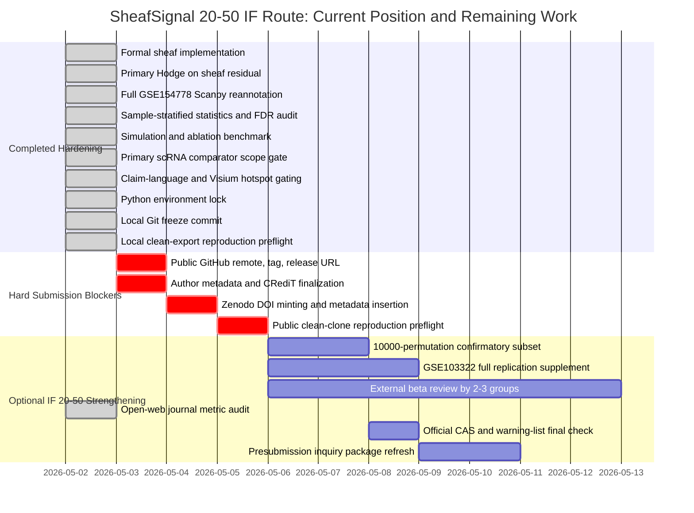

# SheafSignal IF 20-50 Distance Report

- Decision: `IF20_50_SCIENTIFICALLY_HARDENED_BUT_RELEASE_BLOCKED`
- Overall readiness index: `78.0%`
- Scientific/method hardening index: `95.1%`
- Submission infrastructure index: `44.5%`
- Clean-export reproduction preflight: `local_clean_export_pass`
- Journal metric audit: `publisher_if_verified_cas_warning_final_check_required`
- Score boundary: these are internal readiness indices, not acceptance probabilities.

## Direct Answer

SheafSignal is now close to a defensible 20-50 IF methods-manuscript candidate on the scientific/code side, but it is not submission-ready. The main remaining distance is external release and submission metadata: public GitHub URL/tag, real Zenodo DOI, author metadata, and a final public clean-clone reproduction check. A local clean-export preflight has passed when this report shows `local_clean_export_pass`, but it does not replace the final public-GitHub clone test.

The journal-metric audit now anchors the target board to publisher metric pages, while keeping CAS-zone and warning-journal status as official submission-day checks. This strengthens journal selection discipline but does not remove the GitHub/Zenodo/author-metadata blockers.

For a realistic 20-50 IF route, the current package is approximately one release/metadata cycle away from being submit-ready. For a Nature Methods or Nature Biotechnology stretch route, the core package is defensible but would benefit from external beta review, a small 10,000-permutation confirmatory subset, and optionally a fuller GSE103322 replication supplement.

## Current Gap Counts

- Blocking gap rows in the matrix: `21`
- Administrative pending rows: `9`
- Author-owned metadata rows: `20`
- Git release warnings: `2`

## Mandatory Before Any 20-50 IF Submission

- M1. Create public GitHub remote, push codex/sheafsignal-hardening-release, create immutable release tag, and write the URL into CITATION.cff, pyproject.toml, .zenodo.json, and release metadata. Expected effect: Turns G11 from yellow to green after tag/release URL is verified.
- M2. Fill author names, affiliations, ORCIDs when available, CRediT roles, competing interests, corresponding author, and final ethics/data-use wording. Expected effect: Clears author-owned placeholder rows and software citation creator fields.
- M3. Mint Zenodo DOI only after GitHub URL and author metadata are real, then replace PENDING_ZENODO_RELEASE in metadata/datasets.tsv and Data Availability. Expected effect: Turns G12 from red to green and removes the final blocking DOI rows.
- M4. Rerun clean-clone reproduction after GitHub and DOI insertion from the public repository: install locked Python environment, run demo workflow, and regenerate manuscript-facing audits. Expected effect: Converts local clean-export reproducibility into public clean-clone reproducibility evidence.

## High-Value Optional Strengthening

- S1. Run a 10,000-permutation confirmatory pass for the smallest set of manuscript-critical GSE154778/global tests. Expected effect: Improves statistical defensibility; not needed for current descriptive edge claims.
- S2. Complete GSE103322 as an explicit replication supplement with the same primary scRNA comparator scope, or keep it clearly outside main comparator claims. Expected effect: Improves 20-50 IF resilience against dataset-specific-artifact criticism.
- S3. Invite 2-3 external computational biology readers to run the clean-clone demo and review the novelty/comparator framing before submission. Expected effect: Improves cover-letter confidence and reduces desk-rejection risk from unclear novelty or reproducibility.
- S4. Refresh the journal metric audit on the submission day, covering latest JIF source, CAS zone, and warning-journal status for the chosen target. Expected effect: Prevents stale IF/CAS/warning claims in the final submission plan.
- S5. Keep Visium hotspot-only unless adding deconvolution or histology/pathology annotation. Expected effect: Prevents overclaiming while preserving spatial workflow demonstration value.

## Journal Route Snapshot

- Nature Methods: JIF 32.1, 5-year JIF 51.7, route `keep_primary`, CAS/warning boundary `third_party_suggests_cas_1q_top_but_not_officially_verified` / `not_detected_in_accessible_2025_warning_list_mirrors`.
- Nature Biotechnology: JIF 41.7, 5-year JIF 59.5, route `stretch_only`, CAS/warning boundary `third_party_suggests_cas_1q_but_not_officially_verified` / `not_detected_in_accessible_2025_warning_list_mirrors`.
- Molecular Cancer: JIF 33.9, 5-year JIF 35.9, route `fallback_if_cancer_story_strengthens`, CAS/warning boundary `third_party_suggests_cas_1q_but_not_officially_verified` / `not_detected_in_accessible_2025_warning_list_mirrors`.
- Nature Cancer: JIF 28.5, 5-year JIF 28.6, route `stretch_only`, CAS/warning boundary `third_party_suggests_cas_1q_top_but_not_officially_verified` / `not_detected_in_accessible_2025_warning_list_mirrors`.
- Nature Biomedical Engineering: JIF 26.6, 5-year JIF 30.4, route `fallback_only`, CAS/warning boundary `not_open_verified_in_this_audit` / `not_detected_in_accessible_2025_warning_list_mirrors`.
- Nature Machine Intelligence: JIF 23.9, 5-year JIF 31.8, route `not_recommended_currently`, CAS/warning boundary `not_open_verified_in_this_audit` / `not_detected_in_accessible_2025_warning_list_mirrors`.
- Metric boundary: JIF values are tied to publisher metric pages; CAS zone and warning-journal status remain submission-day official checks.

## Gantt Chart

## Files Generated

- `manuscript/IF20_50_GAP_MATRIX.tsv`
- `manuscript/IF20_50_SUPPLEMENTATION_PLAN.tsv`
- `manuscript/IF20_50_DISTANCE_REPORT.md`
- `release/clean_clone_preflight/CLEAN_CLONE_PREFLIGHT_REPORT.md`
- `manuscript/journal_metric_audit/JOURNAL_METRIC_AUDIT.tsv`
- `manuscript/journal_metric_audit/JOURNAL_METRIC_AUDIT_REPORT.md`

## Boundary

This report does not guarantee acceptance in any journal. It defines the shortest defensible route to a 20-50 IF submission package and the extra work most likely to reduce reviewer risk.
