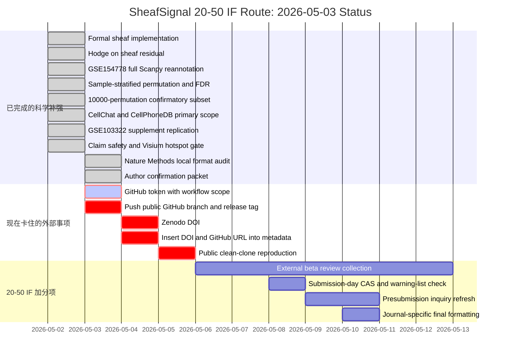

# SheafSignal 20-50 IF 投稿状态中文简报

更新时间：2026-05-03 01:40:00 +08:00

## 一句话结论

SheafSignal 现在已经不是普通 prototype，而是一个已经完成主要科学补强的
20-50 IF methods manuscript candidate；但它还不是 submission-ready package。

最直接的判断：

- 科学和软件侧：接近完成，当前内部评分为 `97.0%`。
- 整体投稿包：仍为 `79.3%`，因为 GitHub/Zenodo/作者确认还没闭环。
- 投稿基础设施：只有 `44.5%`，这是当前最大短板。
- 当前最终状态：`NO_GO`，不能今天正式投稿。

这些百分比是内部 readiness index，不是接收概率。

## 甘特图

## 已经做到哪里

| 模块 | 当前状态 | 投稿含义 |
|---|---|---|
| 算法数学对象 | 已完成 formal rank-one cellular sheaf | 不再只是 graph score 包装 |
| Hodge 分解 | 主分析转为 `sheaf_residual` | 可以更稳地解释为 mismatch/frustration residual |
| GSE154778 | full Scanpy reannotation 已冻结 | 解决只靠 52-gene matrix 的主要风险 |
| 统计 | sample-stratified permutation、FDR、10000 subset | 统计审稿风险明显下降 |
| Comparator | CellChat、CellPhoneDB 已纳入 primary scRNA scope | 方法论文的外部比较短板已大幅补齐 |
| Replication | GSE103322 supplement-grade completed | 增强跨癌种 workflow generality |
| Claim safety | overclaim audit 通过 | 避免把 computational signal 写成临床或机制证明 |
| Nature Methods 格式 | local official format audit 通过 | 形式上接近可打包 |
| 作者确认 | packet/checklist 已生成 | 还需要作者团队确认，不是代码问题 |

## 现在到底缺什么

| 缺口 | 是否需要你亲自动手 | 为什么我不能直接越过 |
|---|---|---|
| GitHub `workflow` 权限 | 需要你重新生成 token，勾选 `repo` 和 `workflow` | 现在 token 能识别账号 `healthgreat`，但缺 `workflow`，GitHub 拒绝推送 `.github/workflows/ci.yml` |
| 公开 GitHub 仓库 | 已创建，push 还没成功 | `https://github.com/healthgreat/SheafSignal` 已存在，`origin` 已配置 |
| GitHub 自动发布脚本 | 我已完成 | `scripts/publish_github_release_after_auth.py` 会在 token 权限通过后自动 push、tag、创建 release；现在按预期拒绝执行 |
| Zenodo DOI | 需要你登录或提供 Zenodo token | DOI minting 必须绑定你的 Zenodo 账户 |
| Han Yan 邮箱、COI、CRediT、funding、ethics wording | 需要作者团队确认 | 这些是作者责任内容，不能由算法自动编造 |
| public clean-clone reproduction | 我来跑 | 但必须等 GitHub/Zenodo 真实存在后才能跑 |

## 距离 20-50 IF 还有多远

最现实的距离不是“再写一点论文”，而是一次 release/metadata cycle：

1. 你重新生成带 `workflow` scope 的 GitHub token。
2. 我 push 当前分支到已创建的 public repo。
3. 我创建 release tag。
4. Zenodo 生成真实 DOI。
5. 我把 DOI 和 GitHub URL 写回 `metadata/datasets.tsv`、Data Availability、CITATION、release metadata。
6. 我从 public GitHub 重新 clean clone，重跑 demo/audit。
7. 重新生成 final GO/NO-GO。

如果这 7 步完成，并且 clean-clone 通过，项目就可以进入正式 20-50 IF 投稿准备阶段。

## 当前期刊路线

| 优先级 | 期刊 | 当前定位 | 风险边界 |
|---|---|---|---|
| 1 | Nature Methods | 首选 methods target | 高风险，但方法定位最匹配 |
| 2 | Nature Biotechnology | stretch route | 需要更强 platform/adoption 叙事 |
| 3 | Molecular Cancer | cancer application fallback | 需要更强癌症生物学故事，不能过度解释 |
| 4 | Nature Cancer | cancer biology stretch | 需要独立生物学验证或更强机制支撑 |
| 5 | Nature Biomedical Engineering | fallback only | 目前工程/转化角度不够强 |
| 6 | Nature Machine Intelligence | 当前不推荐 | 机器学习 novelty 不够核心 |

影响因子、中科院分区和预警状态必须在投稿当天重新核验。

## 还能补什么最有价值

优先级从高到低：

1. 外部 beta review：找 2-3 个计算生物学/单细胞方向的人或 AI 评审，重点审 novelty、reproducibility、overclaim。
2. public clean-clone proof：从公开 GitHub 重新 clone 后一键跑通 demo 和审计，这是 Nature Methods 级别非常关键。
3. Zenodo DOI + immutable release：让代码和数据有永久引用。
4. 作者确认闭环：COI、funding、ethics、CRediT、corresponding author 信息必须干净。
5. 可选加强：如果以后想冲更高，补 Visium deconvolution/pathology 或更多外部用户反馈。

## 我的判断

不建议今天投稿，也不建议现在硬 mint 一个 incomplete release。

建议下一步顺序：

1. 先解决 GitHub token 的 `workflow` scope。
2. 我完成 branch push、release tag、Zenodo DOI、metadata insertion。
3. 我跑 public clean-clone reproduction。
4. 用最终 GO/NO-GO 报告决定投 Nature Methods presubmission 还是先投更稳的 20-40 IF 期刊。

当前最直接的结论是：科学侧已经站起来了，外部发布和作者确认还没闭环。
