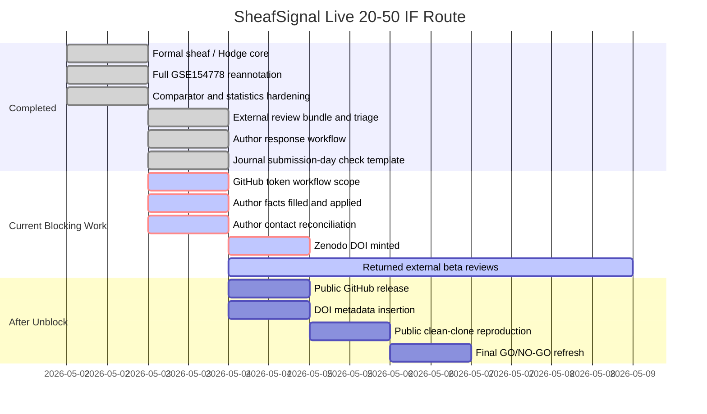

# SheafSignal Live Gantt Status

- Timestamp: `2026-05-03 08:16:18`
- Decision: `LIVE_STATUS_EXTERNAL_AND_AUTHOR_GATES_BLOCK_SUBMISSION`
- IF20-50 decision: `IF20_50_SCIENTIFICALLY_HARDENED_EXTERNAL_RELEASE_BLOCKED`
- Overall readiness: `79.3%`
- Scientific/method readiness: `97.0%`
- Submission infrastructure readiness: `44.5%`

## Gantt

## Live Status Table

| Item | Status | Owner | Blocking | Next action |
|---|---|---|---|---|
| `scientific_method_hardening` | `97.0%` | `codex` | `no` | Keep claims bounded; do not promote computational signals to mechanisms. |
| `submission_infrastructure` | `44.5%` | `user_then_codex` | `yes` | Clear GitHub token, Zenodo DOI, author facts, and public clean-clone gates. |
| `release_blockers` | `7 active` | `user_then_codex` | `yes` | Regenerate GitHub token with workflow scope; mint Zenodo DOI; rerun release pipeline. |
| `author_confirmation` | `blocking=2; pending=8` | `authors` | `yes` | Fill AUTHOR_CONFIRMATION_RESPONSE_TEMPLATE.tsv and apply it. |
| `author_contact_reconciliation` | `AUTHOR_CONTACT_RECONCILIATION_BLOCKED_MISSING_EMAIL` | `authors` | `yes` | Provide Han Yan email and confirm whether extra supplied contacts are authors. |
| `external_beta_reviews` | `EXTERNAL_BETA_REVIEW_NO_RETURNED_REVIEWS` | `user_or_external_reviewers` | `no` | Send shareable bundle, collect returned reviews, and triage them. |
| `shareable_review_bundle` | `SHAREABLE_REVIEW_BUNDLE_READY` | `codex` | `no` | Use bundle zip for external AI or human review. |
| `user_action_now_packet` | `USER_ACTION_PACKET_READY_P0_BLOCKERS_REMAIN` | `user_then_codex` | `no` | Use release/USER_ACTION_NOW_PACKET_ZH.md as the short current unblock list. |
| `external_input_intake` | `EXTERNAL_INPUT_INTAKE_P0_MISSING` | `user_then_codex` | `no` | Fill release/EXTERNAL_INPUT_INTAKE_TEMPLATE.tsv without storing token values. |
| `author_response_from_intake` | `AUTHOR_RESPONSE_FROM_INTAKE_PARTIAL` | `codex` | `no` | Derived from intake; overwrite canonical author response only after review. |
| `unblock_readiness_runner` | `UNBLOCK_READINESS_BLOCKED_EXTERNAL_INPUTS` | `codex` | `no` | Run python scripts/run_unblock_readiness_check.py after external inputs are updated. |
| `journal_submission_day_check` | `JOURNAL_SUBMISSION_DAY_CHECK_TEMPLATE_READY` | `codex_on_submission_day` | `yes` | Fill latest JIF, CAS zone, warning-list status, verifier, and date before submission. |

## Short Interpretation

The scientific and software side is near complete, but submission is still blocked by external release and author-owned facts. The project should not be submitted until GitHub, Zenodo DOI, author confirmation, returned review triage, and public clean-clone checks are complete.

## Boundary

This dashboard is a live internal readiness artifact. It does not guarantee acceptance by any journal.
