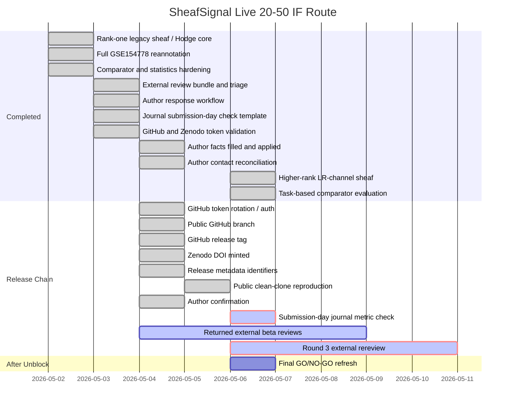

# SheafSignal Live Gantt Status

- Timestamp: `2026-05-06 23:14:52`
- Decision: `LIVE_STATUS_EXTERNAL_AND_AUTHOR_GATES_BLOCK_SUBMISSION`
- IF20-50 decision: `IF20_50_RETURNED_EXTERNAL_REVIEW_BLOCKERS_REMAIN`
- Overall readiness: `98.0%`
- Scientific/method readiness: `97.0%`
- Submission infrastructure readiness: `100.0%`

## Gantt

## Live Status Table

| Item | Status | Owner | Blocking | Next action |
|---|---|---|---|---|
| `scientific_method_hardening` | `97.0%` | `codex` | `no` | Keep claims bounded; do not promote computational signals to mechanisms. |
| `submission_infrastructure` | `100.0%` | `user_then_codex` | `no` | No release-chain blocker remains; proceed with final audits and public clean-clone evidence. |
| `release_blockers` | `0 active` | `user_then_codex` | `no` | No release-chain blocker remains; proceed with final audits and public clean-clone evidence. |
| `author_confirmation` | `blocking=0; pending=0` | `authors` | `no` | No action needed. |
| `author_contact_reconciliation` | `AUTHOR_CONTACT_RECONCILIATION_READY` | `authors` | `no` | No action needed. |
| `external_beta_reviews` | `EXTERNAL_BETA_REVIEW_TRIAGED_FATAL_OR_REJECT_CONCERNS` | `user_or_external_reviewers` | `no` | Send shareable bundle, collect returned reviews, and triage them. |
| `round3_external_rereview` | `pending_external_rereview_after_higher_rank_sheaf_fix` | `user_or_external_reviewers` | `yes` | Send the refreshed shareable and source-code bundles to 2-3 reviewers and ask whether rank-one/trivial-sheaf and circular-benchmark fatal objections are gone. |
| `shareable_review_bundle` | `SHAREABLE_REVIEW_BUNDLE_READY` | `codex` | `no` | Use bundle zip for external AI or human review. |
| `user_action_now_packet` | `USER_ACTION_PACKET_READY_NO_P0_BLOCKERS` | `user_then_codex` | `no` | No P0 user action remains; keep the packet as the short audit trail. |
| `external_input_intake` | `EXTERNAL_INPUT_INTAKE_READY` | `user_then_codex` | `no` | No action needed unless author-owned facts change. |
| `author_response_from_intake` | `AUTHOR_RESPONSE_FROM_INTAKE_READY` | `codex` | `no` | No action needed; canonical author response has been derived from intake. |
| `unblock_readiness_runner` | `UNBLOCK_READINESS_READY_FOR_POST_UNBLOCK_PIPELINE` | `codex` | `no` | Run python scripts/run_unblock_readiness_check.py after external inputs are updated. |
| `journal_submission_day_check` | `JOURNAL_SUBMISSION_DAY_CHECK_TEMPLATE_READY` | `codex_on_submission_day` | `yes` | Fill latest JIF, CAS zone, warning-list status, verifier, and date before submission. |

## Short Interpretation

The release-chain blockers are cleared in the live matrix. Remaining checks are final audit refresh, public clean-clone evidence if newly generated outputs changed, returned beta reviews if available, and submission-day journal metrics.

## Boundary

This dashboard is a live internal readiness artifact. It does not guarantee acceptance by any journal.
