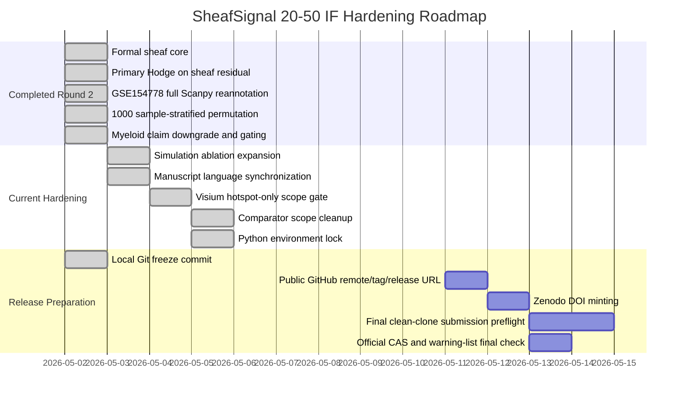

# SheafSignal Status Dashboard

Timestamp: 2026-05-02 19:05:00

## One-Line Status

SheafSignal is now a 20-50 IF manuscript-hardening candidate, not a submission-ready paper.

The core scientific blockers have been substantially reduced after Round 2, especially formal sheaf implementation, full GSE154778 reannotation, sample-stratified permutation, claim gating, simulation baseline hardening, manuscript claim-language synchronization, Visium hotspot-only scope gating, primary scRNA comparator-scope locking, Python environment locking, and a local Git freeze commit. The project should still stay in `NO_GO` for submission until the public GitHub remote/tag/release URL and Zenodo DOI are fixed.

The IF 20-50 distance report now gives the most direct status: overall readiness index `78.0%`, scientific/method hardening index `95.1%`, and submission infrastructure index `44.5%`. A local clean-export reproduction preflight passes, but final public-GitHub clean-clone reproduction is still required after release URL and DOI insertion. These are internal readiness indices, not acceptance probabilities.

The journal metric audit is now generated as a separate evidence file. Publisher JIF values are checked against official metric pages, while CAS zone and warning-list status remain final submission-day checks through the official CAS partition platform or the institutional library.

## Fast Decision Board

| Area | Status | Direct Meaning | Next Required Action |
|---|---|---|---|
| Formal sheaf core | Green | Method object is now implemented, not just described | Keep wording limited to implemented rank-one cellular sheaf |
| Hodge target | Green | Primary Hodge now decomposes `sheaf_residual` | Keep communication-flow Hodge as secondary diagnostic |
| GSE154778 reannotation | Green | Full `scanpy_full_v1` annotation covers 14,926 cells / 16 samples | Preserve this frozen annotation in provenance |
| GSE154778 Myeloid claim | Yellow | Robust enough for supplement hypothesis, not main biological claim | Do not promote to main text unless stronger validation appears |
| GSE154778 statistics | Green/Yellow | 1000 sample-stratified permutations are done | Keep confirmatory claims tied to predefined FDR families |
| Simulation benchmark | Green | Ground-truth benchmark now beats LR-flow, pathway-gradient, Hodge-only, centrality, and graph-smoothness baselines | Use expanded recovery table in method validation |
| Comparator scope | Green | Primary scRNA comparator scope is complete and locked; broad superiority remains forbidden | Preserve primary-scope boundary |
| Visium interpretation | Green | Visium is now explicitly restricted to hotspot-only spot-level demonstration | Preserve hotspot-only boundary unless deconvolution/histology is added |
| Manuscript wording | Green | High-risk real-data wording has been synchronized and claim audits show zero blocking risky claims | Preserve boundary wording during future regeneration |
| Environment lock | Green | Pinned Python lock generated and audited with zero warnings | Use lock for clean-clone reproduction |
| GitHub release | Yellow | Local freeze commit exists; public remote/tag/release URL still missing | Add GitHub remote, create immutable tag, and write release URL into metadata |
| Zenodo DOI | Red | Correctly held, not minted | Mint only after final freeze |
| Release metadata | Red/Yellow | Placeholder audit separates GitHub URL, Zenodo DOI, and author-owned fields | Fill only after real public URL, DOI, and author information exist |
| Clean-export preflight | Green/Yellow | Git-tracked HEAD can run a lightweight clean-export demo and core tests locally | Rerun from public GitHub clone after URL/tag/DOI insertion |
| Journal metric audit | Green/Yellow | Publisher JIF values are anchored to official metric pages; CAS/warning status is not officially verified yet | Recheck selected journal in official CAS/warning sources on submission day |
| Submission | Red/Yellow | Not ready to submit | Clear the red and yellow submission blockers first |

## Gantt View

## What Can Be Claimed Now

- SheafSignal now implements a formal rank-one cellular sheaf workflow for ligand-receptor/pathway mismatch analysis.
- The primary real-data quantity is `sheaf_residual` and its edge/node-level energy, not causal biological feedback.
- GSE154778 Myeloid signal remains visible after lesion stratification and sample-level checks, but only as a supplement-level computational hypothesis.
- Real-data curl and harmonic components should be reported as fitted graph decomposition diagnostics, not validated tumor feedback biology.

## What Must Not Be Claimed Yet

- Do not claim clinical utility, therapeutic guidance, or patient-level decision value.
- Do not claim broad superiority over all CCC tools.
- Do not claim Visium spot labels are true single-cell cell-type sources.
- Do not claim Myeloid is the main biological driver in GSE154778.
- Do not mint Zenodo DOI or publish final GitHub release before scientific freeze.

## Immediate Next Five Actions

1. Add a public GitHub remote and release tag only after author/release metadata are ready.
2. Mint Zenodo DOI only after the final release archive is frozen.
3. Regenerate final submission package after GitHub and Zenodo identifiers are inserted.
4. Run final clean-clone submission preflight.
5. Keep comparator claims limited to the completed primary scRNA scope.

## Evidence Files

- `external_ai_review_packet/ROUND2_HARDENING_STATUS_2026-05-02.md`
- `external_ai_review_packet/round1_review_response_matrix.tsv`
- `manuscript/SHEAFSIGNAL_STATUS_GATES_2026-05-02.tsv`
- `manuscript/claim_hardening/CLAIM_HARDENING_REPORT.md`
- `manuscript/visium_scope/VISIUM_SCOPE_REPORT.md`
- `manuscript/comparator_scope/COMPARATOR_SCOPE_REPORT.md`
- `envs/ENVIRONMENT_LOCK_REPORT.md`
- `release/GIT_RELEASE_READINESS_REPORT.md`
- `release/RELEASE_METADATA_PLACEHOLDER_REPORT.md`
- `release/clean_clone_preflight/CLEAN_CLONE_PREFLIGHT_REPORT.md`
- `manuscript/IF20_50_DISTANCE_REPORT.md`
- `manuscript/journal_metric_audit/JOURNAL_METRIC_AUDIT_REPORT.md`
- `benchmarks/results/BENCHMARK_RESULT_CONTRACT_REPORT.md`
- `benchmarks/results/simulation/sheaf_ground_truth_recovery.csv`
- `manuscript/NATURE_METHODS_GO_NO_GO_REPORT.md`
