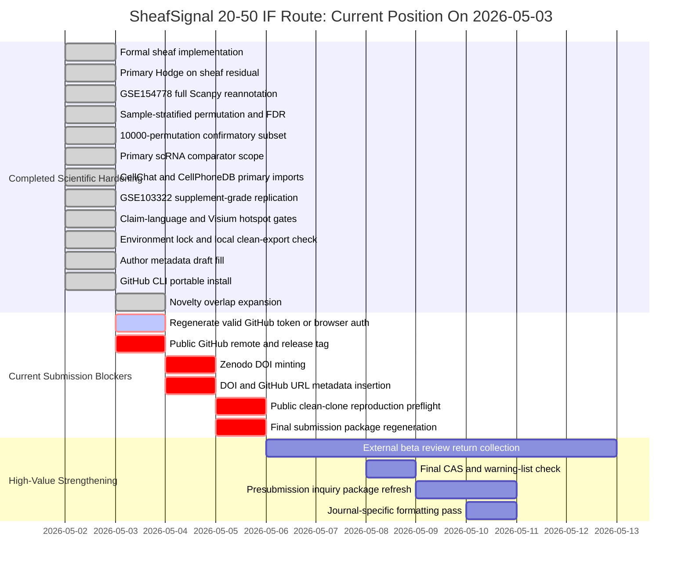

# SheafSignal Status Dashboard

Timestamp: 2026-05-03 01:15:42 +08:00

## Direct Status

SheafSignal is a scientifically hardened 20-50 IF methods-manuscript candidate,
but it is not submission-ready yet.

Current readiness snapshot:

- Overall readiness index: 79.3%.
- Scientific/method hardening index: 97.0%.
- Submission infrastructure index: 44.5%.
- Final local decision: NO_GO for formal submission.
- Current live blocker: GitHub CLI is installed, but authentication is still
  blocked because `D:\secrets\github_token.txt` returns GitHub API `HTTP 401:
  Bad credentials`.

Interpretation boundary: these are internal readiness indices, not acceptance
probabilities.

## What Is Finished

- Formal rank-one cellular sheaf implementation is complete.
- Primary decomposition is now based on `sheaf_residual`, not only raw
  communication flow.
- GSE154778 full Scanpy reannotation is frozen as `scanpy_full_v1`.
- Sample-stratified permutation and FDR workflow are implemented.
- The 10,000-permutation confirmatory subset has been executed.
- Primary scRNA comparator scope is locked and passes for GSE72056, GSE154778,
  and GSE176078.
- CellPhoneDB and CellChat are complete inside the primary scRNA comparator
  scope.
- GSE103322 is complete as supplement-grade HNSCC workflow replication.
- Visium is restricted to spot-level hotspot demonstration.
- Claim safety audits show no blocking overclaim language.
- Python environment lock and local clean-export reproduction preflight pass.
- Author metadata placeholders have been replaced by author-provided draft
  metadata, with remaining author confirmations tracked explicitly.
- Novelty/overlap table has been expanded from 5 to 7 comparison classes,
  adding niche/regression methods and spatial neighborhood/domain methods.

## What Is Blocking Submission

| Blocker | Current status | Why it matters | Owner |
|---|---|---|---|
| GitHub public repository | GitHub CLI installed, token invalid, no remote URL | Journals and reviewers need public, citable code | User must regenerate token once; Codex handles login/push/release |
| Zenodo DOI | Not minted | Data/code availability needs a permanent DOI | User Zenodo login/token once; Codex handles metadata insertion |
| Public clean-clone reproduction | Pending | Local clean export is not enough for final reproducibility | Codex after GitHub/Zenodo identifiers are real |
| Final journal metric/CAS/warning check | Pending submission-day check | IF, CAS zone, and warning status can change | Codex checks again before submission |
| Corresponding author confirmation | Draft metadata filled | COI, CRediT, funding, and ethics text need author approval | User/corresponding authors |

## Distance To A 20-50 IF SCI Submission

Short answer: the project is close on the scientific and software side, but
blocked by external release infrastructure.

Practical distance:

- To a realistic 20-50 IF submission package: one release/metadata cycle away,
  after a valid GitHub token or browser authorization is completed.
- To Nature Methods as the primary methods target: technically plausible as a
  stretch submission after GitHub, Zenodo, and clean-clone checks, but still
  high risk.
- To Nature Biotechnology: stretch only; would benefit from stronger platform
  framing and more external adoption or independent user feedback.
- To Molecular Cancer or Nature Cancer: possible only if the biological cancer
  story is strengthened without overclaiming computational signals.

## Recommended Journal Route

| Priority | Journal | Current role | 2024 JIF basis in current audit | Current fit |
|---|---|---|---|---|
| 1 | Nature Methods | Primary methods target | 32.1 JIF; 51.7 five-year JIF | Best aligned, high risk |
| 2 | Nature Biotechnology | Stretch methods platform | 41.7 JIF; 59.5 five-year JIF | Stretch only |
| 3 | Molecular Cancer | Cancer application fallback | 33.9 JIF; 35.9 five-year JIF | Possible if cancer story strengthens |
| 4 | Nature Cancer | Cancer biology stretch | 28.5 JIF | Needs stronger biology validation |
| 5 | Nature Biomedical Engineering | Fallback only | 26.6 JIF | Needs stronger engineering/translation angle |
| 6 | Nature Machine Intelligence | Not recommended currently | 23.9 JIF | Needs real ML novelty beyond sheaf/Hodge workflow |

CAS zone and warning-list status remain official submission-day checks.

## Gantt Chart



## What The User Must Still Do

The user does not need to run bioinformatics code manually. The remaining user
actions are account/author-confirmation steps that Codex cannot legitimately
bypass:

1. Regenerate a valid GitHub token or complete GitHub browser authorization for
   GitHub CLI.
2. Provide or approve a public GitHub repository name/owner.
3. Complete Zenodo login or provide a local token file path outside the repo.
4. Confirm Han Yan's email, COI, CRediT, funding, and ethics/data-use wording.

Codex can handle the rest: pushing, tagging, release metadata updates, DOI
insertion, clean-clone tests, final reports, and submission package regeneration.

## What Can Be Added To Improve 20-50 IF Defensibility

- Returned external beta review from 2-3 independent computational biology
  readers.
- A short user-facing tutorial notebook that reproduces the demo and one public
  benchmark subset.
- A final novelty table cross-check against graph signal processing, Hodge
  omics, sheaf-theoretic biology, niche/regression, and spatial neighborhood
  methods. Current status: expanded to 7 classes; citation placeholders still
  require author/literature verification.
- Optional Visium deconvolution or histology/pathology annotation if the spatial
  story is promoted beyond hotspot demonstration.
- Optional additional cancer dataset only if it can be processed with the same
  reproducibility and annotation gates.

## Bottom Line

SheafSignal should not be submitted today. It is, however, close to a defensible
20-50 IF submission package once GitHub, Zenodo, and final clean-clone release
checks are completed.

## Live GitHub Authorization Note

The file `D:\secrets\github_token.txt` exists, but GitHub rejects it with:

```text
HTTP 401: Bad credentials
```

This means the token is invalid, expired, revoked, copied incorrectly, or not a
GitHub personal access token. The token content was not printed or committed.
Regenerate a new token, overwrite the same file, and rerun the GitHub login
step.

## Latest Non-Release Strengthening

On 2026-05-03, the novelty/overlap package was strengthened:

- `manuscript/novelty_overlap/SHEAFSIGNAL_NOVELTY_OVERLAP_TABLE.tsv`
  now compares 7 method classes.
- `manuscript/novelty_overlap/SHEAFSIGNAL_NOVELTY_OVERLAP_REPORT.md`
  now states the safest one-sentence novelty claim.
- `manuscript/presubmission_inquiry/03_novelty_evidence_matrix.tsv`
  now reflects the completed primary scRNA comparator scope including
  CellPhoneDB and CellChat.

This improves reviewer defensibility, but it does not remove the GitHub/Zenodo
release blockers.
