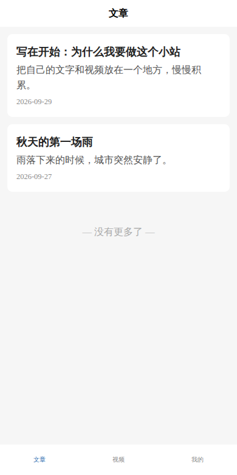
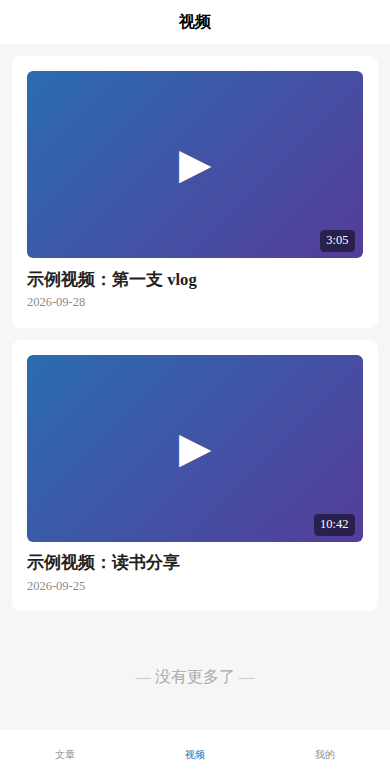
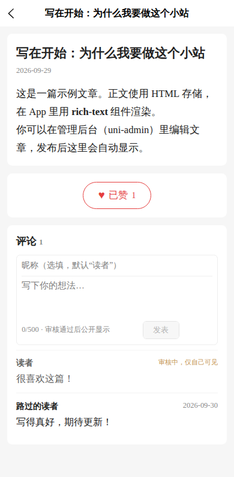
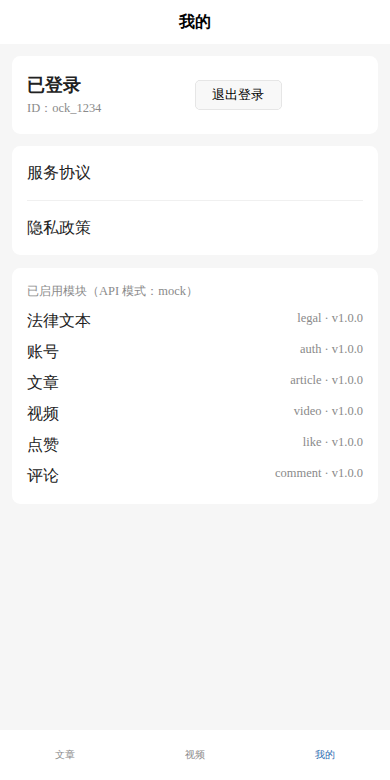

# 我的小站：个人内容 App

一个用来发布**自己的文章和视频**的手机 App。读者可以**匿名点赞**，也可以**登录后评论**。

- **技术栈**：uni-app（Vue 3）+ uniCloud（阿里云），一套代码同时产出 Android App、iOS App、H5 和微信小程序。
- **架构**：模块化 + 统一接口。每个功能都是可以插拔的独立模块，详见 [docs/ARCHITECTURE.md](docs/ARCHITECTURE.md)。
- **上架**：国内应用商店上架的完整清单见 [docs/LAUNCH-CHECKLIST.md](docs/LAUNCH-CHECKLIST.md)。

| 文章 | 视频 | 详情（点赞 + 评论） | 我的 |
|---|---|---|---|
|  |  |  |  |

## 功能

| 模块 | 功能 | 是否需要登录 |
|---|---|---|
| `article` | 文章列表、详情（HTML 正文） | 否 |
| `video` | 视频列表、详情、B 站播放器 | 否 |
| `like` | 点赞，按设备去重 | 否 |
| `comment` | 评论，先审后发 | 是（手机号验证，后台实名、前台显示昵称） |
| `auth` | 手机号验证码登录、"我的"页面 | — |
| `legal` | 隐私政策、服务协议 | — |

## 快速开始

需要 Node.js ≥ 18（WSL / Linux / macOS 均可）。

```bash
cd personal-content-app
npm install
npm run dev:h5        # 浏览器预览：打开终端里显示的地址（默认 http://localhost:5173）
```

默认是 **mock 模式**：所有数据都来自各模块的 `mock.js`，不需要任何云服务就能完整预览。
登录时手机号随便填 11 位，验证码填 `123456`。

### 常用命令

```bash
npm run dev:h5            # H5 开发预览
npm run dev:mp-weixin     # 微信小程序（用微信开发者工具导入 dist/dev/mp-weixin）
npm run build:app         # App 资源（用 HBuilderX 导入 dist/build/app 后云打包）
npm run gen               # 手动重新装配模块（dev/build 会自动运行）
npm test                  # 运行全部单元测试
```

### 切换到真实云端

```bash
cp .env.example .env      # 然后把 VITE_API_MODE=mock 改成 VITE_API_MODE=cloud
```

关联服务空间、部署云对象等步骤见
[上架清单 · 阶段 2](docs/LAUNCH-CHECKLIST.md#阶段-2接入真实云端)。
页面代码不需要任何改动。测试会检查 mock 和云端返回的字段是否一致。

## 目录结构

```
personal-content-app/
├── src/
│   ├── config/
│   │   ├── modules.config.json   # ⭐ 启用哪些模块（插拔开关）
│   │   ├── slots.json            # 扩展插槽定义
│   │   └── app.config.json       # App 名称、导航栏、tab 样式
│   ├── core/                     # 核心层：api、session、events、registry（模块只能 import 这里）
│   ├── modules/                  # 业务模块，每个都有 module.json
│   │   ├── article/  video/  like/  comment/  auth/  legal/
│   ├── generated/                # 自动生成，请勿手改
│   ├── pages.json                # 自动生成，请勿手改
│   ├── manifest.json             # App 配置（已精简 Android 权限）
│   └── androidPrivacy.json       # Android 首次启动的隐私政策弹窗
├── uniCloud-aliyun/
│   ├── cloudfunctions/
│   │   ├── common/app-core/      # ⭐ 后端统一接口层 + 前后端共用的 contract.json
│   │   └── mod-article/ mod-video/ mod-like/ mod-comment/
│   └── database/                 # 数据库 schema 与索引
├── scripts/gen-modules.mjs       # 模块校验 + 装配
├── tests/                        # 单元测试（node:test，无额外依赖）
└── docs/
```

## 验证状态

| 项目 | 状态 |
|---|---|
| H5 / App / 微信小程序三端编译 | ✅ 通过 |
| H5 mock 模式端到端流程（浏览 → 点赞 → 登录 → 评论 → 审核中） | ✅ 在 Chromium 中实际走通 |
| 单元测试（统一接口层、4 个云端模块、装配脚本、前端核心层） | ✅ 26 / 26 |
| 卸载模块演示（删掉 comment 后详情页只剩点赞；删掉 auth 时构建报出依赖错误） | ✅ |
| 真实 uniCloud 部署、uni-id 短信登录、App 云打包 | ⚠️ 尚未验证：需要你的 DCloud 账号和 HBuilderX |

## ⚠️ 上线前必须替换

- `src/modules/legal/pages/*.vue`、`src/androidPrivacy.json`：隐私政策和服务协议模板
- `src/modules/video/mock.js`：占位 BV 号（`BV1xxxxxxxxx`）
- `uniCloud-aliyun/cloudfunctions/common/app-core/moderation.js`：关键词审核只是占位实现，需要换成专业的内容安全服务
- `src/manifest.json`：`appid`（在 HBuilderX 中获取）

## License

MIT
