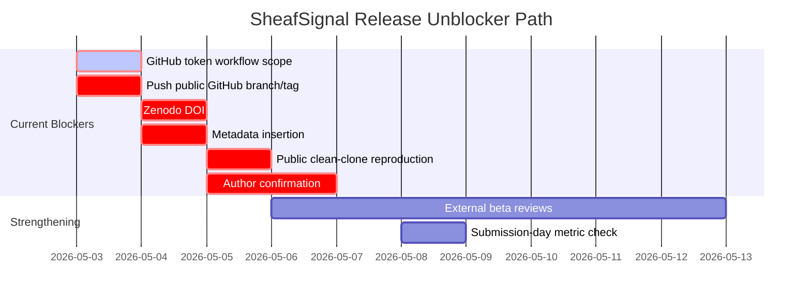

# SheafSignal Release Unblocker Runbook

Timestamp: 2026-05-03 02:00:00 +08:00

## Direct Status

- Blocking or mandatory release gates tracked: `7`.
- Gates already partly configured: `1`.
- Current decision: `RELEASE_NOT_READY_UNTIL_GITHUB_ZENODO_AUTHOR_CONFIRMATION`.

This runbook is for release execution. It does not guarantee acceptance in any
journal and does not change the evidence boundary of the manuscript.

## Gate Matrix Summary

- `G01_github_auth`: `valid_missing_workflow_scope` -> Regenerate a GitHub token with repo and workflow scopes or finish browser login, then let Codex validate auth.
- `G02_public_github_repo`: `origin_configured_push_pending` -> Create or connect a public GitHub repository and push the frozen branch.
- `G03_release_tag`: `pending` -> Create an immutable release tag after final audits pass.
- `G04_zenodo_doi`: `blocking_pending` -> Upload the frozen archive or provide a Zenodo token, then mint a real DOI.
- `G05_metadata_insertion`: `pending_real_github_url_and_doi` -> Insert public GitHub URL and Zenodo DOI into all release and manuscript metadata.
- `G06_public_clean_clone`: `pending` -> Clone the public repository into a fresh directory and rerun demo plus audits.
- `G07_author_confirmation`: `AUTHOR_CONFIRMATION_BLOCKED` -> Confirm corresponding author email, equal-contribution wording, CRediT, funding, COI, ethics/data-use, and release approval.
- `S01_external_beta_review`: `recommended_not_required_for_local_go` -> Send the package to 2-3 independent computational biology readers and triage responses.
- `S02_submission_day_metric_check`: `pending_submission_day` -> Recheck journal metrics, CAS zone, and warning status on the submission day.

## Execution Order

1. Complete `G01_github_auth`.
2. Let Codex execute `G02_public_github_repo` and `G03_release_tag` with:
   `python scripts/publish_github_release_after_auth.py --create-release`.
3. Complete `G04_zenodo_doi`.
4. Let Codex execute `G05_metadata_insertion`.
5. Let Codex execute `G06_public_clean_clone`.
6. Authors complete `G07_author_confirmation`.
7. Optional but high-value: complete `S01_external_beta_review`.
8. On the exact submission day, complete `S02_submission_day_metric_check`.

## Mermaid Gantt

## User Boundary

The user only needs to authorize accounts and confirm author-owned facts.
Codex can perform repository creation, release tagging, DOI metadata insertion,
audits, and clean-clone verification after those external gates are unlocked.
