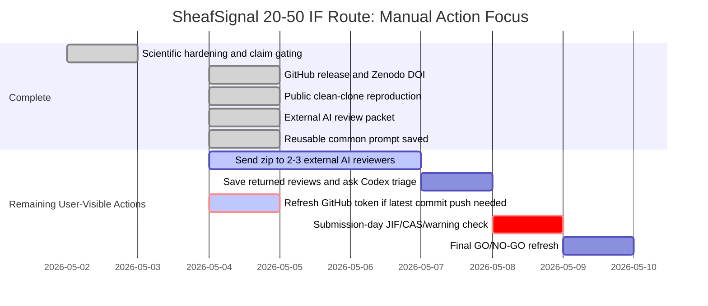

# SheafSignal User Manual Actions

Generated: 2026-05-04 07:32:00 +08:00

## Current Direct Status

- Internal IF20-50 readiness: `98.0%`
- Scientific/method readiness: `97.0%`
- Submission infrastructure readiness: `100.0%`
- Local Git branch: `codex/sheafsignal-hardening-release`
- Local latest commit before this manual: `c498bbe Add external AI review routing packet`
- Remote branch latest checked commit: `fef0655 Record public clean-clone release evidence`
- GitHub CLI status: not logged in

This means the manuscript/release package is locally ready for a defensible
20-50 IF submission route, but the newest external-review-routing commit has
not yet been pushed to GitHub.

## Manual Action 1: Send The External AI Review Package

This is recommended risk reduction, not a hard local blocker.

### Files To Use

All paths below are relative to the SheafSignal project root.

- Review bundle zip:
  `external_ai_review_packet/shareable_review_bundle/sheafsignal_external_beta_review_bundle.zip`
- Source-code review zip:
  `external_ai_review_packet/source_code_review_bundle/sheafsignal_source_code_review_bundle.zip`
- Role-specific reviewer prompts:
  `external_ai_review_packet/EXTERNAL_AI_REVIEW_ROUTING_2026-05-04.md`
- Code-review prompt:
  `external_ai_review_packet/EXTERNAL_AI_CODE_REVIEW_PROMPT_2026-05-04.md`
- Returned review folder:
  `external_ai_review_packet/returned_reviews/`

### Exact Steps

1. Open the reviewer prompt file.
2. Upload the zip package to Reviewer 1 AI and paste the Reviewer 1 prompt.
3. Upload the same zip package to Reviewer 2 AI and paste the Reviewer 2 prompt.
4. Optional: upload the same zip package to Reviewer 3 AI and paste the Reviewer 3 prompt.
5. For code-level review, upload the source-code review zip to a code-capable AI
   reviewer and paste the code-review prompt.
6. Save returned reviews into:
   - `reviewer1_methods_novelty.md`
   - `reviewer2_singlecell_spatial_claims.md`
   - `reviewer3_statistics_reproducibility.md`
   - `reviewer4_code_review.md`
7. Put those files in:
   `external_ai_review_packet/returned_reviews/`
8. Tell Codex:
   `Returned external reviews are saved. Please triage them.`

### What Codex Will Do After Reviews Return

```bash
python scripts/triage_external_beta_reviews.py
python scripts/build_live_gantt_status.py
python scripts/build_if20_50_gap_report.py
python scripts/check_final_submission_blockers.py --report-only
```

## Manual Action 2: Refresh GitHub Token If You Want Latest Commit Pushed

This is needed only if you want the new external-review-routing commit pushed
to GitHub.

### Why This Is Needed

The GitHub CLI currently reports that it is not logged in. Earlier token
validation returned `HTTP 401: Bad credentials`, so the token file should be
treated as invalid.

### Exact Steps

1. Open GitHub classic token settings:
   https://github.com/settings/tokens
2. Click `Generate new token`, then `Generate new token (classic)`.
3. Set `Note` to:
   `SheafSignal Codex push`
4. Set expiration to a short period, for example 7 or 30 days.
5. Select scopes:
   - `repo`
   - `workflow`
6. Click `Generate token`.
7. Copy the token once.
8. Save it into:
   `D:\secrets\github_token.txt`
9. Do not paste the token into chat.
10. Tell Codex:
    `GitHub token has been refreshed and saved. You can push.`

### What Codex Will Do After Token Refresh

```bash
gh auth login --hostname github.com --git-protocol https --with-token
gh auth setup-git --hostname github.com
git push origin codex/sheafsignal-hardening-release
```

## Manual Action 3: Submission-Day Journal Metric / CAS / Warning Check

This is required immediately before journal submission because journal metrics,
CAS zone, and warning-list status can change.

### Official Or Near-Official Links To Check

- Nature Portfolio journal metrics:
  https://www.nature.com/nature-portfolio/about/journal-metrics
- Nature Methods journal metrics:
  https://www.nature.com/nmeth/journal-impact
- Molecular Cancer journal page:
  https://molecular-cancer.biomedcentral.com/about
- CAS partition platform:
  https://www.fenqubiao.com/
- CAS partition API platform / contact:
  https://webapi.fenqubiao.com/

### Exact Steps

1. On the intended submission day, open the target journal metric page.
2. Record:
   - Journal Impact Factor
   - 5-year Journal Impact Factor
   - source URL
   - access date
3. Open the CAS partition platform:
   https://www.fenqubiao.com/
4. Search the target journal name.
5. Record:
   - CAS major category zone
   - CAS minor category zone
   - Top journal status, if shown
   - warning-list status
6. Send the values to Codex or paste them into the submission-day checklist.

### What Codex Will Do After Values Are Known

```bash
python scripts/apply_journal_submission_day_check.py
python scripts/build_if20_50_gap_report.py
python scripts/check_final_submission_blockers.py --report-only
```

## Current Gantt



## Boundary

These steps reduce submission risk. They do not guarantee acceptance by Nature
Methods, Nature Biotechnology, Molecular Cancer, or any 20-50 IF journal.
